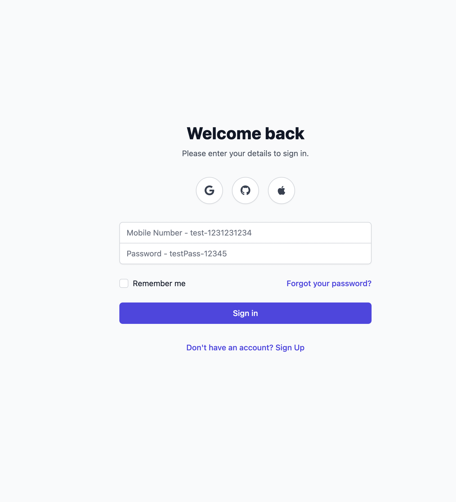
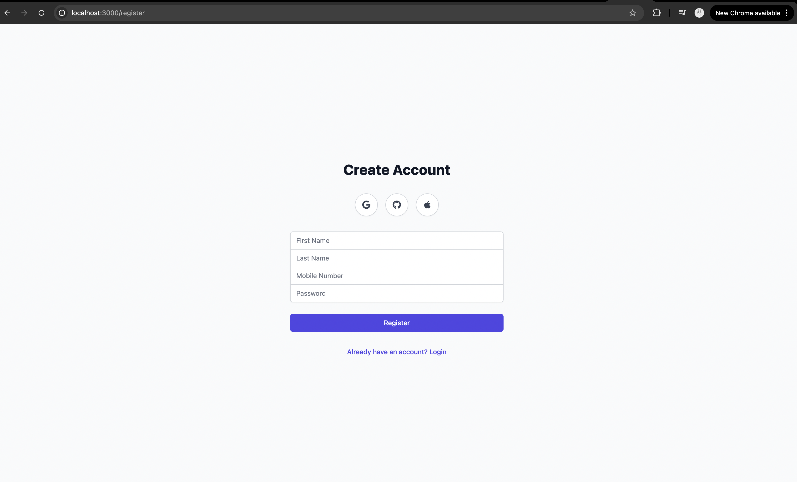
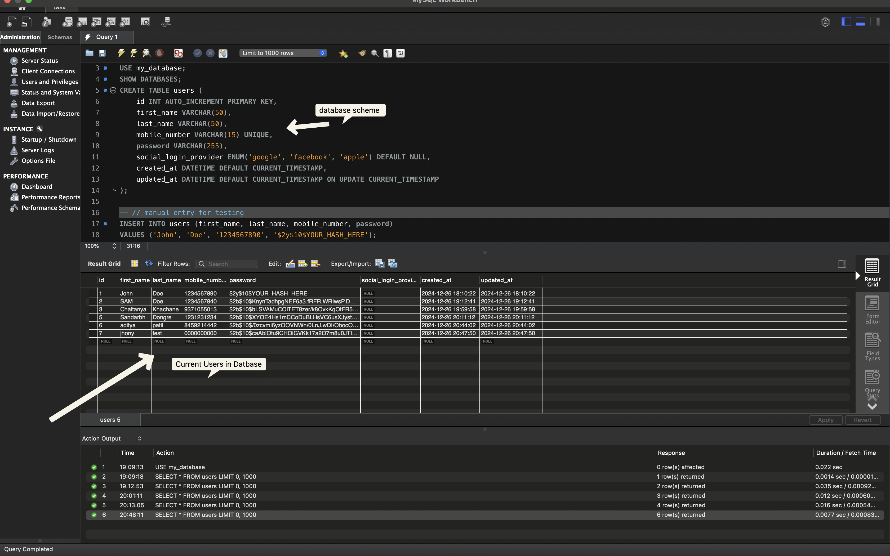

# CRUD API Documentation

This Node.js application, powered by Express and MySQL, demonstrates a complete CRUD (Create, Read, Update, Delete) API. The app leverages environment variables for secure configuration and includes CORS for cross-origin requests. Below, we detail the endpoints and functionality provided by this application.


## Table of Contents

- [App Images / Landing Page](#Images)
- [Features Overview](#features-overview)
- [API Endpoints](#api-endpoints)
  - [Create Record](#1-create-record)
  - [Retrieve Record](#2-retrieve-record)
  - [Update Record](#3-update-record)
  - [Delete Record](#4-delete-record)
- [Notes](#notes)
- [Run the Application](#run-the-application)
- [Conclusion](#conclusion)

# Images
### Dashboard - This is what user sees when he logs in


### Login Page


### Register Page


### My Sql Database



## Features Overview

- **User Registration:** Users can register by providing essential details like first name, last name, mobile number, and password. Passwords are securely hashed using bcrypt before being stored in the database.
- **CRUD Operations:** The app includes endpoints to create, retrieve, update, and delete user records. However, only the **POST** request is accessible to general users. All other requests are restricted to administrative access and are meant to be executed via the terminal.

---

## API Endpoints

### 1. **Create Record**
**HTTP Verb:** POST  
**Endpoint:** `/register`

#### Description
Allows users to register by creating a new record in the database.

#### Request Body
```json
{
  "firstName": "John",
  "lastName": "Doe",
  "mobileNumber": "1234567890",
  "password": "securePassword"
}
```

#### Response (Success)
```json
{
  "message": "User registered successfully",
  "userId": 1
}
```

---

### 2. **Retrieve Record**
**HTTP Verb:** GET  
**Endpoint:** `/user/:id`

#### Description
Retrieves user details for the given `id`. Accessible only to admin.

#### Example Request
`GET /user/1`

#### Response (Success)
```json
{
  "id": 1,
  "first_name": "John",
  "last_name": "Doe",
  "mobile_number": "1234567890",
  "password": "<hashed_password>"
}
```

---

### 3. **Update Record**
**HTTP Verb:** PUT  
**Endpoint:** `/user/:id`

#### Description
Updates the user details for the given `id`. Accessible only to admin.

#### Request Body
Provide one or more fields to update:
```json
{
  "firstName": "Jane",
  "password": "newSecurePassword"
}
```

#### Response (Success)
```json
{
  "message": "User updated successfully"
}
```

---

### 4. **Delete Record**
**HTTP Verb:** DELETE  
**Endpoint:** `/user/:id`

#### Description
Deletes the user record for the given `id`. Accessible only to admin.

#### Example Request
`DELETE /user/1`

#### Response (Success)
```json
{
  "message": "User deleted successfully"
}
```

---

## Notes

- **Security:** Only the POST request (`/register`) is accessible to regular users via external clients or the frontend application. All other operations (GET, PUT, DELETE) are restricted for administrative purposes and must be executed through the terminal.
- **Database Configuration:** The application uses MySQL as the database. Connection settings such as `host`, `user`, `password`, and `database` are managed via environment variables (`.env` file).
- **Password Management:** All passwords are hashed using bcrypt before being saved, ensuring secure user authentication.
- **Error Handling:** Comprehensive error handling ensures that appropriate error messages are returned for invalid inputs or server-side issues.

---

## Run the Application
1. Clone the repository.
2. Install dependencies using `npm install`.
3. Create a `.env` file and provide the necessary database credentials:
   ```
   DB_HOST=your-database-host
   DB_USER=your-database-user
   DB_PASSWORD=your-database-password
   DB_NAME=your-database-name
   DB_PORT=3306
   PORT=5001
   ```
4. Start the server with `node server.js`.
5. The server will run on `http://localhost:5001`.


